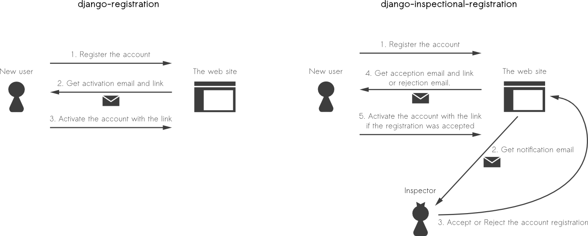

.. django-inspectional-registration documentation master file, created by
   sphinx-quickstart on Sat Feb 25 12:18:30 2012.
   You can adapt this file completely to your liking, but it should at least
   contain the root `toctree` directive.

Welcome to django-inspectional-registration's documentation!
============================================================

django-inspectional-registration is a enhanced application of
django-registration_. The following features are available

-   Inspection steps for registration. You can accept or reject the account
    registration before sending activation key to the user.

-   Password will be filled in after the activation step to prevent that the
    user forget them previously filled password in registration step (No
    password filling in registration step)

-   Password can be generated programatically and force to activate the
    user. The generated password will be sent to the user by e-mail.

-   Any Django models are available to use as supplemental information of
    registration if the models are subclasses of
    :py:class:`registration.supplements.RegistrationSupplementBase`. 
    It is commonly used for inspection.

-   You can send any additional messages to the user in each steps
    (acception, rejection and activation)

-   The behaviors of the application are customizable with Backend feature.

-   The E-mails or HTMLs are customizable with Django template system.

-   Can be migrate from django-registration_ simply by south_

-   `django-mailer <http://code.google.com/p/django-mailer/>`_ compatible.
    Emails sent from the application will use django-mailer if 'mailer' is
    in your ``INSTALLED_APPS``

Contents:

.. toctree::
    :maxdepth: 2

    quicktutorials
    quickmigrations
    about_registration_supplement
    about_registration_backend
    about_registration_templates
    about_registration_settings

The difference between django-registration
------------------------------------------------------------------------------------

While django-registration_ requires 3 steps for registration,
django-inspectional-registration requires 5 steps and inspector for
registration. See the conceptual summary below.

.. _django-registration: https://bitbucket.org/ubernostrum/django-registration/
.. _south: http://south.aeracode.org/

Indices and tables
==================

* :ref:`genindex`
* :ref:`modindex`
* :ref:`search`

